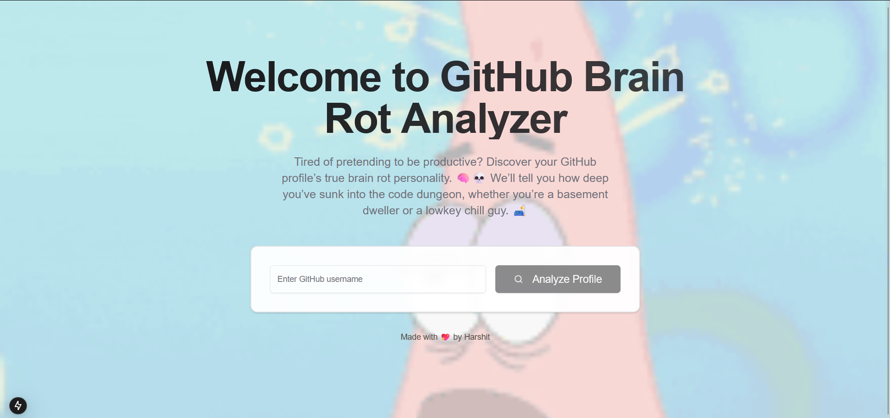

## Github User Profile Analayzer

## TypeScript/NextJs

Built using Next.js, TypeScript, Tailwind CSS, and ShadCN, leveraging the power of MetaLLama 3 hosted on AWS Bedrock




## 🚀 Getting Started  

### Open Using Daytona  

1. **Install Daytona**: Follow the [Daytona installation guide](https://www.daytona.io/docs/installation/installation/).  
2. **Create the Workspace**:  
   ```bash  
   daytona create https://github.com/daytonaio/sample-nextjs-github-user-insights
   ```  
3. **Copy Env Files**:
4. ```bash
   cp .env.example .env.local
   ```

   Then, fill in the following fields in the `.env.local` file:

   ```bash
   NEXT_PUBLIC_GITHUB_TOKEN=""
   NEXT_PUBLIC_AWS_ID=""
   NEXT_PUBLIC_AWS_REGION=""
   NEXT_PUBLIC_AWS_SECRET=""
   ```
5. **Start the development Server**:
   ```bash
   npm run dev
   ```
